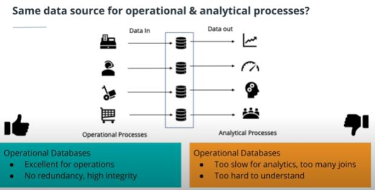
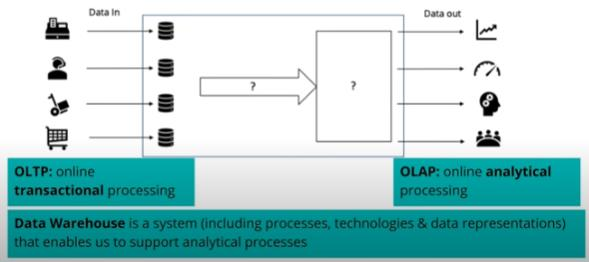
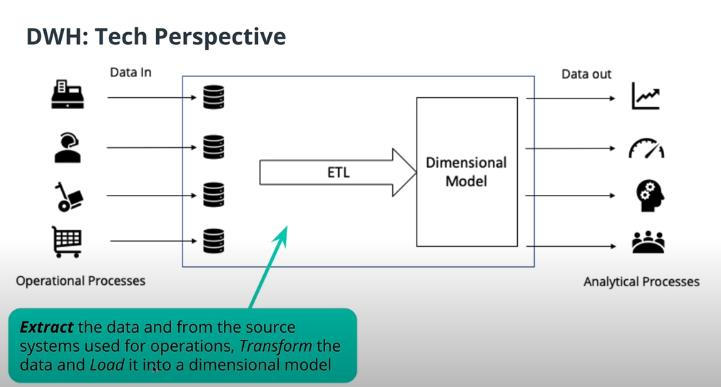
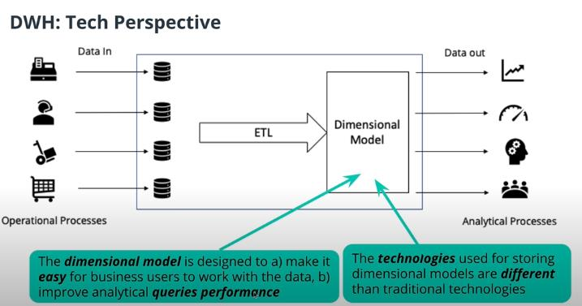
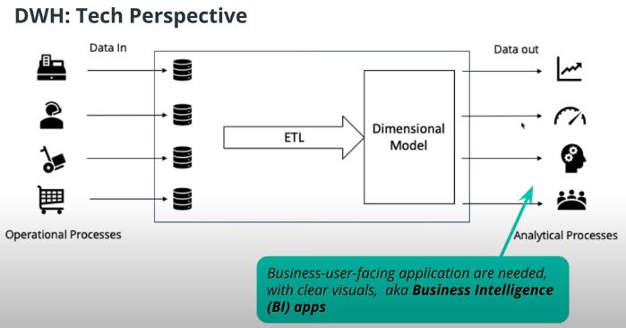

## What is a Data Warehouse
* 데이터 웨어하우스는 방대한 조직 내에서 분산 운영되는 각각의 데이터 베이스 관리 시스템들을 효율적으로 통합하여 조정, 관리 한다.
* 데이터 웨어하우스의 구성은 관리 하드웨어, 관리 소프트웨어, 추출ㆍ변환ㆍ정렬 도구, 데이터 베이스 마케팅 시스템, 메타 데이터, 최종 사용자 접근 및 활용 도구등 으로 구성되어 있다.
* 전략적 관점에서 효율적인 의사 결정을 지원하기 위해 데이터의 시계열적 축적과 통합을 목표로 한다.
* 데이터 웨어하우스는 경영자의 의사 결정을 지원하는 데이터의 집합체로 주제 지향적, 통합적, 시계열적, 비휘발적 특성을 갖는다.

### Perspective
*  데이터 웨어하우스는 비지니스 관점, 기술적 관점으로 볼 수 있다.

 먼저 비지니스 관점에서 보면 운영 프로세스, 분석 프로세스로 나눌 수 있는데 운영 프로세스에선 데이터를 모으고 분석 프로세스에서는 모인 데이터를 분석한다. 하지만 이 둘이 같은 데이터를 쓴다면 데이터를 모으는 운영 프로세스는 필요해보이는 데이터를 모두 모으기 때문에 별 문제가 없지만, 분석 프로세스에서는 전략적 관점에서 데이터를 분석해야하기 때문에 데이터 분석이 불편하다. 그래서 기술적 관점에서 보는 것이 필요하다.

먼저 ETL을 통해 데이터를 가공한다.

모델은 비지니스 사용자가 쉽게 작업 할 수 있도록 설계 해야하고, 빠른 분석을 위해 쿼리 성능을 높여야 한다.

시각적(그래프, 차트)으로 보여주기 위한 애플리케이션이 필요하다.

* 기술적인 목표는 다음과 같다.
    * 비지니스 사용자가 이해하기 쉬워야 한다.
    * 품질 및 성능이 좋아야 한다.
    * 새로운 쿼리를 처리를 유연하게 할 수 있어야한다.
    * 보안이 유지 되어야 한다.
