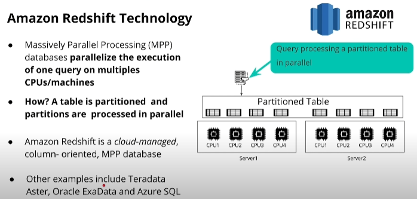
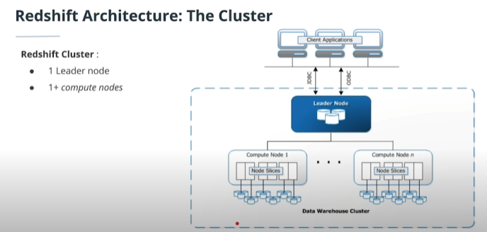
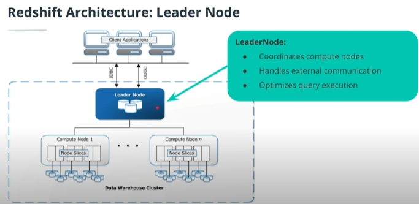
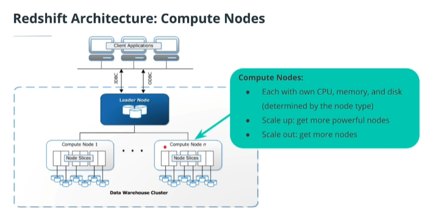

# Amazon Redshift 

- Amazon Redshift Technology
- Amazon Redshift Architecture

Amazon의 Data Warehouse에 속해 있는 Redshift의 기본적인 `Technology, Architecture`에 관해 살펴보겠습니다.

## Amazon Redshift Technology

데이터를 저장할때 크게 `Column oriented, Row oriented` 방식으로 나뉩니다. 간단히 말해 Row oriented는 디스크 블록에 행 단위로 저장이 되고 Column oriented는 열 단위로 저장이 됩니다. 이런 저장 방식 때문에 행 단위작업에는 Row oriented가 유리하고 열 단위 작업에는 Column oriented 방식이 유리합니다.

Redshift는 `Column-oriented storage` 입니다. 열 단위로 저장되기 때문에 열 단위로 작업되는` OLAP` 환경에서 유리하고 오래된 Column이라도 한번에 Column 데이터를 불러오기 때문에 오래된 데이터에도 강점을 갖습니다. 또 한 `postgresql`을 사용하는데 이 부분은  추후에 설명하겠습니다.

Redshift는 `MPP(Massively Parallel Processing)`를 통해 쿼리를 처리합니다. MPP란 대용량 병렬 처리라는 뜻으로 쿼리에 맞는 테이블을 partition단위로 다수의 cpu에 분산시켜 병렬로 작업하는 방식입니다. MPP 방식을 사용함으로서 아무리 복잡한 쿼리라고 해도 빠른 속도로 실행, 처리할 수 있습니다.

#### Amazon Redshift Architecture

다음으로 `Redshift Architecture`에 대해 보겠습니다. Redshift는 1개의 `Leader node`와 1개 이상의 `Compute node`로 구성되는 `Cluster` 입니다. Node들의 역활을 자세히 보겠습니다.

Leader node의 역활은 `Communication, Coordinates` 2가지로 볼 수 있습니다.  JDBC, ODBC를 이용한 Client Applications들과 Leader node 간의 Communication,    그리고 Communication을 통해 받은 query를 Optimizes하여 compute node를 Coordinates 하는 것 입니다.  

쉽게 말해 Communication이란 Leader node, App간의 통신,  Coordinates는 위에서 본 `MPP` 방식으로 처리 하는 것입니다. Leader node가  table, data를 patition하는 과정 자체가 query를 optimizes 한다고 볼 수 있습니다.

Compute node는 Leader node에게 할당받은 작업을 처리하는 역활입니다. 각 Compute node들은 전용 cpu, memory, disk가 있으며 compute node들을 `Scale up, Scale out` 함으로서 Cluster의 성능, 용량을 늘릴수 있습니다.

마지막으로 Compute node들의 Slices에 대해 보겠습니다. Slices는 Compute node에서 할당받은 별도의 memory, disk를 가지며, Slice 갯수에 따라 n개의 파티션 만큼 작업을 할수 있습니다.

---

Amazon Redshift 공식 문서를 보시면 더 자세하고 정확한 설명을 볼수 있습니다.  [Amazon Redshift ](https://docs.aws.amazon.com/ko_kr/redshift/latest/dg/c_high_level_system_architecture.html)

